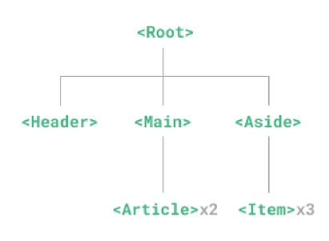

# Component
- 재사용 가능한 코드블록
- UI를 독립적이고 재사용 가능한 일부분으로 분할하고 각 부분을 개별적으로 다룰 수 있음
- 애플리케이션은 중첩된 component의 트리 형태로 구성됨


## Single-File Components
- 컴포넌트의 템플릿, 로직 및 스타일을 하나의 파일로 묶어낸 특수한 파일 형식 (*.vue)
- Vue SFC는 HTML, CSS 및 JS를 단일 파일로 합친 것
- 각 파일은 세가지 유형의 최상위 언어 블록 **template**, **script**, **style**으로 구성됨
- 언어 블록의 작성 순서는 상관없으나 일반적으로 template > script > style순으로 작성
- 각 파일은 최상위 **template**, **script setup**블록을 하나만 포함할 수 있음
- 컴포넌트의 setup()함수로 사용되며 컴포넌트의 각 인스턴스에 대해 실행
- 변수 및 함수는 동일한 컴포넌트의 템플릿에서 자동으로 사용가능
- 여러 style태그가 포함될 수 있음
- scoped가 지정되면 CSS는 현재 컴포넌트에만 적용됨

## Vite
- 프론트 엔드 개발 도구
- 빠른 개발 환경을 위한 빌드 도구와 개발 서버를 제공
---
- Build
  - 프로젝트의 소스 코드를 최적화하고 번들링하여 배포할 수 있는 형식으로 변환하는 과정
  - 개발 중에 사요되는 여러 소스 파일 및 리소스(JS, CSS IMG 등)를 최적화된 형태로 조합하여 최종 소프트웨어 제품을 생성하는 것
---
- vite 프로젝트 생성
```
프로젝트 시작
$ npm create vue@latest

프로젝트 폴더 이동
$ cd vue-project

패키지 설치
$ npm install

Vue 프로젝트 서버 실행
$ npm run dev
```

## NPM (Node Package Manager)
- Node.js의 기본 패키지 관리자
- 기존에 브라우저 안에서만 동작할 수 있었던 JS를 브라우저가 아닌 서버 측에서도 실행할 수 있게 함
- NPM을 활용해 수많은 오픈 소스 패키지와 라이브러리를 제공하여 개발자들이 손쉽게 코드를 공유하고 재사용 할 수 있게 함

## Module
- 프로그램을 구성하는 독립적인 코드 블록 (*.js 파일)
- 개발하는 애플리케이션의 크기가 커지고 복잡해지면서 파일 하나에 모든 기능을 담기가 어려워짐
- 파일을 여러 개로 분리하여 관리를 하게 되었고, 이때 분리된 각 파일이 바로 모듈

### 모듈의 한계
- JS 모듈의 개수가 증가함에 따라 성능 병목 현상이 발생하고 모듈 간의 의존성(연결성)이 깊어지면서 특정한 곳에서 발생한 문제가 어떤 모듈 간의 문제인지 파악하기 어려워 짐
- 복잡하고 깊은 모듈 간 의존성 문제를 해결하기 위한 도구가 필요 (Bundler)

## Bundler
- 여러 모듈과 파일을 하나(혹은 여러 개)의 번들로 묶어 최적화하여 애플리케이션에서 사용할 수 있게 만들어주는 도구
- 의존성 관리, 코드 최적화, 리소스 관리 등
---
- node_modules
  - Node.js 프로젝트에서 사용되는 외부 패키지들이 저장되는 디렉토리
  - 프로젝트의 의존성 모듈을 저장하고 관리하는 공간
  - 프로젝트가 실행도리 때 필요한 라이브러리와 패키지들을 포함
  - .gitignore에 작성됨
- package-lock.json
  - 패키지들의 실체 설치버저느 의존성 관계, 하위 패키지 등을 포함하여 패키지 설치에 필요한 모든 정보를 포함
  - 패키지들의 정확한 버전을 보장하여, 여러 개발자가 협업하거나 서버 환경에서 일관성 있는 의존성을 유지하는데 도움을 줌
  - npm install 명령을 통해 피키지를 설치할 때, 명시된 버전과 의존성을 기반으로 설치
- package.json
  - 프로젝트의 메타 정보와 의존성 패키지 목록을 포함
  - 프로젝트의 이름, 버전, 작성자, 라이선스 등과 같은 메타 정보를 정의
  - package-lock.json과 함께 프로젝트의 의존성을 관리하고, 버전 충돌 및 일관성을 유지하는 역할
- publlic 디렉토리
  - 주로 정적 파일을 위치 시킴
    - 소스코드에서 참조되지 않는
    - 항상 같은 이름을 갖는
    - import할 필요 없는
  - 항상 root 절대 경로를 사용하여 참조
    - public/icon.png는 소스코드에서 /icon.png로 참조할 수 있음
- src 디렉토리
  - 프로젝트의 주요 소스 코드를 포함하는 곳
  - 컴포넌트, 스타일, 라루팅 등 프로젝트의 핵심 코드를 관리
- src/assets
  - 프로젝트 내에서 사용되는 자원(이미지, 폰트, 스타일 시트 등)을 관리
  - 컴포넌트 자체에서 참조하는 내부 파일을 저장하는데 사용
  - 컴포넌트가 아닌 곳에서는 publcic 디렉토리에 위치한 파일을 사용
- src/components
  - Vue 컴포넌트들을 작성하는 곳
- src/App.vue
  - Vue 앱의 최상위 Root 컴포넌트
  - 다른 하위 컴포넌트들을 포함
  - 애플리케이션 전체의 레이아웃과 공통적인 요소를 정의
- src/main.js
  - Vue 인스턴스를 생성하고, 애플리케이션을 초기화 하는 역할
  - 필요한 라이브러리를 import하고 전역 설정을 수행
- index.html
  - Vue 앱의 기본 HTML 파일
  - 앱의 진입점
  - Root 컴포넌트인 App.vue가 해당 페이지에 마운트 됨
  - 필요한 스타일 시트, 스크립트 등의 외부 리소스를 로드 할 수 있음(ex. bootstrap CDN)
- 기타 설정 파일
  - jsconfig.json
    - 컴파일 옵션, 모듈 시스템 등 설정
  - vite.config.js
    - Vite 프로젝트 설정 파일
    - 플러그인, 빌드 옵션, 개발 서버 설정 등

## Vue Component 활용
- 컴포넌트 사용 2단계
    1. 컴포넌트 파일 생성
    2. 컴포넌트 등록 (import)
- 사전 준비
    1. 초기에 생성된 모든 컴포넌트 삭제 (App.vue 제외)
    2. App.vue 코드 초기화
